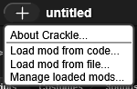

# CrackleSDK

A modding framework for Snap!, made by [@tethrarxitet](https://forum.snap.berkeley.edu/u/tethrarxitet) and 
[@codingisfun2831t](https://forum.snap.berkeley.edu/u/codingisfun2831t).

# Loading in browser
For now, CrackleSDK does not have any pages for it on common browser extension stores. I do not know the process for Chrome, but on Firefox go to `about:debugging`, go to `This Firefox`, click `Load Temporary Add-on...` and select the `manifest.json` file in this directory. Now, whenever you launch Snap! you should see the new addon button.

# How to use
When launching Snap! with Crackle open, you should see a new button being added to the title bar:

If you were to click on the addon button, you'll see this menu popup:

Here is what each of those options do:

* `About Crackle...` - Display a dialog containing info about Crackle
* `Load mod from code...` - Load mod from direct code
* `Load mod from file...` - Load mod from a file on your computer
* `Manage loaded mods...` - Display a menu allowing you to see info or delete mods currently loaded

For mod creators, check out [the API documentation](doc/API.md) so you can make your own mods.